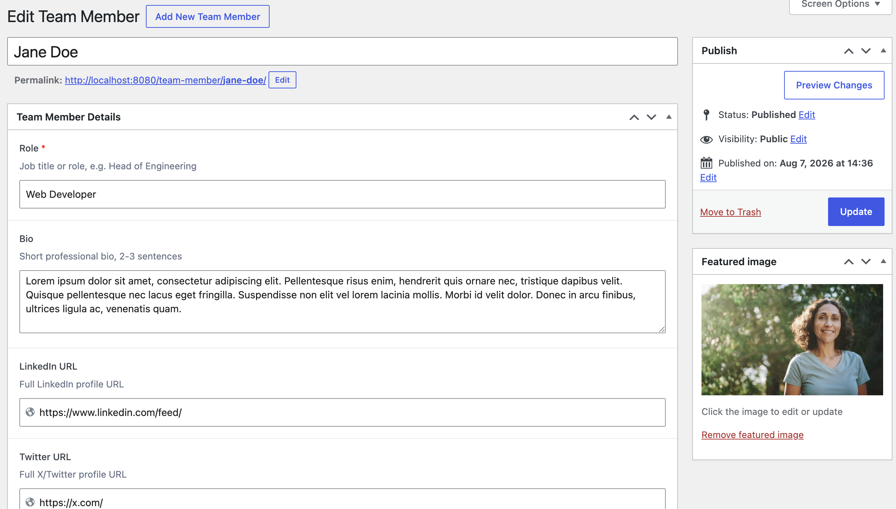
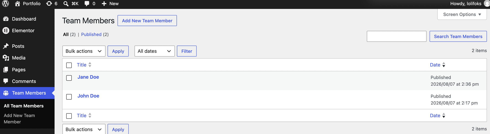

# Elementor ACF Team Card

A custom Elementor widget that renders a team-member card with content pulled from Advanced Custom Fields on a custom post type. Built as a portfolio piece to demonstrate Elementor and ACF integration alongside responsive HTML, CSS, and vanilla JavaScript.


## Why I built it

Team member cards are a repeat need for content-heavy WordPress sites: About pages, agency directories, testimonials. Building them once as an Elementor widget that reads from a structured post type (rather than gluing them together in the page builder each time) means editors get consistent output and developers get a real content model.

The same argument applies to any site that publishes the same component shape over and over: campaign landing pages, study pages, location pages. Put the content in fields, put the markup in one place, and the two stop drifting apart.

## Features

- Custom "Team Member" post type registered in code
- ACF field group registered in code (role, bio, LinkedIn, X/Twitter, email)
- Elementor widget with SELECT and SWITCHER controls
- Social links render conditionally, so a member with no LinkedIn simply doesn't get the link
- Responsive layout (mobile stacked, desktop side-by-side at 1024px)
- CSS custom properties for easy theming
- Vanilla JS hover interaction with keyboard focus support
- BEM class naming, mobile-first CSS
- Assets registered so they only load on pages that use the widget
- All output escaped (`esc_html`, `esc_url`, `wp_kses_post`)
- Passes WordPress Coding Standards (WPCS 3.x) clean

## Tech stack

- WordPress 6.0+
- PHP 7.4+
- Elementor (free)
- Advanced Custom Fields (free)

## Screenshots

### Front end

Two cards side by side at desktop width. John has only an email address on file, Jane has all three, so the social row renders differently for each without any per-page configuration.


### Editing a team member

The ACF field group as the editor sees it. Role is required, bio has a character guide, the URL fields are typed as URLs so they validate, and the photo uses the standard WordPress featured image so there is no bespoke upload flow to maintain.



### Team Members admin

The custom post type in the admin menu with its own icon and list table.



## Installation

1. Ensure Elementor and Advanced Custom Fields are installed and active.
2. Copy the folder into `wp-content/plugins/`.
3. Activate from the Plugins screen.
4. Create Team Members under the "Team Members" menu with their photo and details.
5. Edit any page in Elementor, drag "Team Card" from the widget panel, pick a team member.

The plugin checks for both dependencies on load and deactivates itself with an admin notice if either is missing, rather than fataling.

## Development

```
composer install
docker compose exec -w /var/www/html/wp-content/plugins/elementor-acf-team-card wordpress php vendor/bin/phpcs
```

## Author

**Marija Lekić**

- GitHub: <https://github.com/lolifoks>

## License

GPL-2.0-or-later
